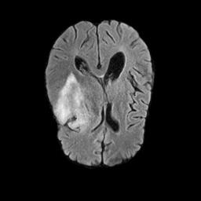

<h2>BraTS21-ImageMask-Dataset (Updated: 2024/02/19)</h2>
This is a simple dataset RSNA-ASNR-MICCAI Brain Tumor Segmentation (BraTS 2021) 
for Image Segmentation.   

<li>2024/02/19: Updated ImageMaskDatasetGenerator.generate_image_files method not to use matplotlib</li>
 
<h3>1. Dataset Citation</h3>

The dataset used here has been taken from Task1 (Segmentation) dataset of the following website. 

<b>RSNA-ASNR-MICCAI Brain Tumor Segmentation (BraTS) Challenge 2021</b> 

http://braintumorsegmentation.org/ 

<pre>
The RSNA-ASNR-MICCAI BraTS 2021 challenge utilizes multi-institutional pre-operative baseline 
multi-parametric magnetic resonance imaging (mpMRI) scans, and focuses on the evaluation of 
state-of-the-art methods for (Task 1) the segmentation of intrinsically heterogeneous brain 
glioblastoma sub-regions in mpMRI scans. 
Furthemore, this BraTS 2021 challenge also focuses on the evaluation of (Task 2) classification 
methods to predict the MGMT promoter methylation status.

Data Usage Agreement / Citations
You are free to use and/or refer to the BraTS datasets in your own research, 
provided that you always cite the following three manuscripts: 

[1] U.Baid, et al., "The RSNA-ASNR-MICCAI BraTS 2021 Benchmark on Brain Tumor 
Segmentation and Radiogenomic Classification", 
arXiv:2107.02314, 2021(opens in a new window). 

[2] B. H. Menze, A. Jakab, S. Bauer, J. Kalpathy-Cramer, K. Farahani, J. Kirby, et al. 
"The Multimodal Brain Tumor Image Segmentation Benchmark (BRATS)", 
IEEE Transactions on Medical Imaging 34(10), 1993-2024 (2015) 
DOI: 10.1109/TMI.2014.2377694 (opens in a new window) 

[3] S. Bakas, H. Akbari, A. Sotiras, M. Bilello, M. Rozycki, J.S. Kirby, et al., 
"Advancing The Cancer Genome Atlas glioma MRI collections with expert segmentation 
labels and radiomic features", Nature Scientific Data, 4:170117 (2017) 
DOI: 10.1038/sdata.2017.117(opens in a new window)
</pre>

<h3>
2. Download master dataset
</h3>
  Please download the original BraTS21 data dataset from the following website.  
<a href="http://braintumorsegmentation.org/">RSNA-ASNR-MICCAI Brain Tumor Segmentation (BraTS) Challenge 2021</a> 
 

The dataset has the following folder structures. 
<pre>
./BRATS21
├─BraTS2021_00000
├─BraTS2021_00002
├─BraTS2021_00003
├─BraTS2021_00005
├─BraTS2021_00006
...
└─BraTS2021_01666
</pre>

Each sub-folder of BraTS21 contains five NIfTI files (.nii.gz) as shown below. 
<pre>
./BraTS2021_00000
├─BraTS2021_00000_flair.nii.gz
├─BraTS2021_00000_seg.nii.gz
├─BraTS2021_00000_t1.nii.gz
├─BraTS2021_00000_t1ce.nii.gz
└─BraTS2021_00000_t2.nii.gz
</pre>

For simplicity, we use the following two types of NIfTI files. 
<pre>
flair.nii.gz : fluid-attenuated inversion recovery MR images
seg.nii.gz   : segmentation images 
</pre>

<h3>
3. Create ImageMask Dataset
</h3>
<h3>
3.1 Create ImageMask-master dataset
</h3>
Please move to <b>generator</b> directory, and run the following command. 
<pre>
>python ./ImageMaskDatasetGenerator.py
</pre>

By using this Python script <a href="./generator/ImageMaskDatasetGenerator.py">ImageMaskDatasetGenerator.py</a>,
 we have created <b>BraTS21-master</b> jpg image dataset of image-size 256x256 from the 
 *.nii.gz files in <b>BraTS21/BraTS2021_*/</b> folders. 

<pre>
./BraTS21-master
├─images
└─masks
</pre>

<h3>
3.2 Split master to test, train and valid 
</h3>
Please run the following command. 
<pre>
python split_master.py
</pre>
, by which we have finally created <b>BraTS21</b> dataset from the BraTS21-master. 
<pre>
../BraTS21-ImageMask-Dataset
├─test
│  ├─images
│  └─masks
├─train
│  ├─images
│  └─masks
└─valid
    ├─images
    └─masks
</pre>
<b>train/images samples:</b> 

 
<b>train/masks samples:</b> 

 
BraTS21-ImageMask-Dataset Statistics: 
 

<h3>3.3 Validate mask regions </h3>
Please run the following command to validate mask regions corresponding to images
in <b>./BraTS21-ImageMask-Dataset/train</b> folder. 
<pre>
python ImageMaskBlender.py
</pre> 
, by which <b>Blended_mini_train_dataset</b> can be created, 
Blended_train_dataset samples: 
 
 
Enlarged images: 
<table>
<thead>
<tr>
<td>
images
</td>
<td>
masks
</td>
<td>
blended
</td>
</tr>
</thead>
<tbody>
<tr>
<td></td>
<td></td>
<td></td>
</tr>

<tr>
<td></td>
<td></td>
<td></td>
</tr>

<tr>
<td></td>
<td></td>
<td></td>
</tr>

<tr>
<td></td>
<td></td>
<td></td>
</tr>

<tr>
<td></td>
<td></td>
<td></td>
</tr>

<tr>
<td></td>
<td></td>
<td></td>
</tr>

</tbody>
</table>
 

<h3>
4. Download BraTS21-ImageMask-Dataset.zip
</h3>

You can download this dataset from the following google drive 
<a href="https://drive.google.com/file/d/1gyLoQcMA6t9_jlSDY0YzVXf8UZn56H3D/view?usp=sharing">
BraTS21-ImageMask-Dataset.zip</a>
 

